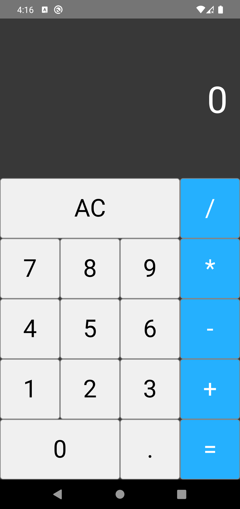
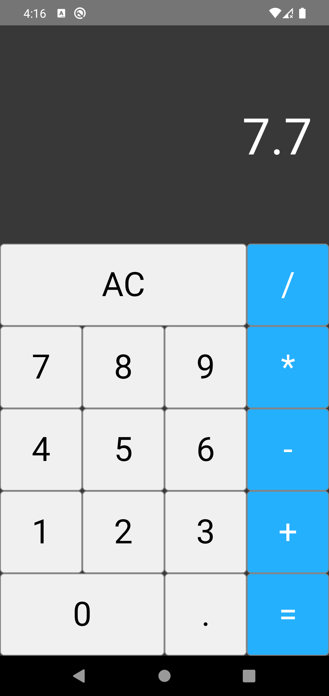

<h1 align="center">Calculator(React-Native)</h1>

<div align="center">
  
  
</div>

> Aplicativo mobile de calculadora que realiza as operações básicas criado em React Native, para criação do app foi utilizado as formas
mais atuais de programação com react, sendo utilizado hooks e clean code.

# instalação:
  * Certifique-se de ter instalado corretamente as dependencias e aplicações para rodar o react native, você pode verificar isso no site:
    https://reactnative.dev/docs/environment-setup
  * Entre com o terminal na pasta do arquivo para instalar as dependências do projeto e digite:  
      ```
      yarn install
      ```
  * ou  
      ```
      npm install
      ```
  
  * Para Executar o aplicativo digite os seguintes comandos no terminal(na pasta da aplicação):
      ```
      npx react-native start
      ```
  * Abra outro terminal e digite:
      ```
      npx react-native run-android
      ```
  
  espere um tempinho... e pronto!! o app calculator está rodando :blush:
